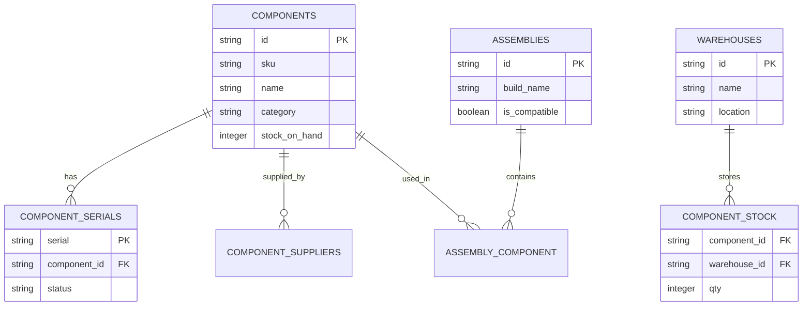

Product Requirements Document (PRD)
Sistem Manajemen & Validasi Perakitan Komponen (Hardware Build ERP)
Versi: 1.2 (Standar Industri)
Tech Stack (MVP rekomendasi): Backend: Golang (Fiber, GORM), PostgreSQL (JSONB), Frontend: React, TailwindCSS, Zustand/Redux.

Ringkasan Eksekutif
-------------------
Sistem ini ditujukan untuk toko, distributor, dan service center yang merakit dan menjual perangkat keras. Fitur inti: katalog komponen dinamis, Rule Engine validasi kompatibilitas, Assembly Builder UI, stok transaksional atomik, serial/lot tracking, dan integrasi POS minimal. Dokumen ini disusun sesuai praktik industri: tujuan bisnis, success metrics, personas, ruang lingkup, acceptance criteria, data model, API surface, non-functional requirements, risiko & mitigasi, roadmap, dan lampiran teknis (user stories, JSON Schema, OpenAPI skeleton, ER diagram).

Tujuan & Success Metrics
------------------------
- Tujuan utama: kurangi kesalahan kompatibilitas, jaga akurasi stok, percepat waktu rakit.
- Metrics target: akurasi stok >= 99%, validasi error rate < 1%, waktu validasi (p95) < 300ms, mean time-to-build < 10 min.

Personas
--------
- Staff Ritel / Sales
- Teknisi Rakitan
- Warehouse Manager
- Admin / Operations

Scope (MVP)
-------------
- In Scope: Katalog dinamis, Rule Engine dasar (socket, power, RAM), Assembly Builder, checkout atomik, serial/batch tracking, CSV import, basic reporting.
- Out of Scope (MVP): full accounting integration, marketplace sync, advanced forecasting.

Fitur Prioritas (Ringkasan)
--------------------------
- MUST (P0): FR-001 Katalog Komponen Dinamis; FR-002 Rule Engine Validasi; FR-003 Assembly Builder UI; FR-004 Stok Transaksional Atomik.
- SHOULD (P1): FR-005 Multi-kategori & serial/batch tracking; FR-006 Reporting & Alerts; FR-007 Audit Trail.
- CAN (P2): FR-008 Barcode/QR scanning; FR-009 Supplier & PO; FR-010 Webhooks / Events.

Acceptance Criteria (MUST)
-------------------------
- AC-FR-001: CRUD komponen dengan atribut dinamis tersimpan di JSONB; pencarian & filter berdasarkan atribut teknis.
- AC-FR-002: Rule Engine menandai setiap pelanggaran dengan pesan yang dapat dimengerti; rules dapat ditambahkan tanpa deploy ulang (data-driven).
- AC-FR-003: UI meng-update status kompatibilitas dan mekanisme substitusi dalam waktu respons pengguna (<300ms pada environment dev).
- AC-FR-004: Checkout menggunakan reservation pattern dan DB transaction; stok tidak boleh negatif pada skenario concurrency tinggi.

Analisis Gap & Rekomendasi
-------------------------
- Gap: Dokumen awal belum memiliki user stories, JSON Schema, kontrak API, dan diagram ER — ditambahkan pada lampiran.
- Rekomendasi: Terapkan JSON Schema validation pada `Specs`, buat test suite untuk setiap rule, dan buat OpenAPI untuk integrasi.

Core Data Model (ringkasan)
--------------------------
type Component struct {
		ID              string  `json:"id"`
		SKU             string  `json:"sku"`
		Name            string  `json:"name"`
		Category        string  `json:"category"` // CPU, GPU, Motherboard, PSU, Case, RAM, Storage, Mobile
		Manufacturer    string  `json:"manufacturer"`
		Model           string  `json:"model"`
		BasePrice       float64 `json:"base_price"`
		StockOnHand     int     `json:"stock_on_hand"`
		ReservedQty     int     `json:"reserved_qty"`
		Location        string  `json:"location"`
		IsSerialTracked bool    `json:"is_serial_tracked"`
		Specs           map[string]interface{} `json:"specs"` // JSONB
}

type AssemblyBuild struct {
		ID              string   `json:"id"`
		BuildName       string   `json:"build_name"`
		ComponentSKUs   []string `json:"component_skus"`
		TotalPowerW     int      `json:"total_power_w"`
		TotalPrice      float64  `json:"total_price"`
		IsCompatible    bool     `json:"is_compatible"`
		ValidationNotes []string `json:"validation_notes"`
		CreatedBy       string   `json:"created_by"`
}

Rule Engine (desain singkat)
---------------------------
- Engine menerima `AssemblyBuild` + catalog lookup, mengeksekusi rule-set terurut, mengembalikan `ValidationNotes`.
- Rule example: SocketRule, PowerBudgetRule, RAMTypeRule, SizeFitRule.
- Rules dapat diekspresikan sebagai JSON/YAML dengan `expression` atau sebagai plugin Go yang mengikuti interface Rule.

API Surface (awal)
------------------
- GET /api/components
- POST /api/components
- GET /api/components/{sku}
- POST /api/assemblies/validate
- POST /api/assemblies
- POST /api/assemblies/{id}/checkout

Non-Functional Requirements
---------------------------
- Performance: validateAssembly p95 < 300ms (<=20 komponen).
- Scalability: desain untuk 100k+ SKU.
- Reliability: ACID untuk stock critical flows; audit logging.
- Security: JWT auth, RBAC, input validation.
- Observability: structured logs, metrics, tracing.

Risks & Mitigasi
----------------
- False-positive rules — mitigasi: rule test suite, manual override, human-in-loop.
- Stock race conditions — mitigasi: DB row locking, reservation pattern, idempotent checkout.

Roadmap (tingkat tinggi)
------------------------
- Sprint 1: Katalog + CSV import + JSON Schema validation.
- Sprint 2: Assembly Builder + Rule Engine (socket & power rules).
- Sprint 3: Checkout atomik + serial tracking + basic POS flow.

Lampiran Teknis
===============

1) User Stories (epic -> stories)
- Epic: Katalog Komponen Dinamis (FR-001)
	- US-001-1: Sebagai Admin, saya dapat menambah komponen dengan atribut teknis spesifik kategori sehingga produk dapat dicari berdasarkan spesifikasi.
	- US-001-2: Sebagai Staff, saya dapat mengimpor file CSV untuk menambah banyak SKU sekaligus.
	- US-001-3: Sebagai Warehouse Manager, saya dapat menandai produk sebagai `serial-tracked` atau `batch-tracked`.

- Epic: Rule Engine & Assembly Builder (FR-002, FR-003)
	- US-002-1: Sebagai Teknisi, ketika saya memilih CPU dan Motherboard, sistem menampilkan error jika socket tidak cocok.
	- US-002-2: Sebagai Staff, saya melihat estimasi total power draw dan peringatan jika PSU tidak mencukupi.
	- US-002-3: Sebagai Sales, saya dapat menyimpan Build Template untuk penawaran cepat.

- Epic: Checkout & Stok (FR-004)
	- US-003-1: Sebagai Customer-facing staff, saya dapat melakukan checkout dan sistem akan mereservasi stok sampai pembayaran dikonfirmasi.
	- US-003-2: Sebagai Ops, saya dapat melihat history perubahan stok per transaksi dan mengaudit serial yang keluar.

2) JSON Schema untuk `Specs` (contoh kategori)
-- CPU Specs (json-schema)
{
	"$id": "https://example.com/schemas/cpu.json",
	"type": "object",
	"required": ["socket", "cores", "tdp"],
	"properties": {
		"socket": {"type":"string"},
		"cores": {"type":"integer","minimum":1},
		"tdp": {"type":"integer","minimum":1},
		"integrated_graphics": {"type":"boolean"}
	},
	"additionalProperties": true
}

-- Motherboard Specs
{
	"$id": "https://example.com/schemas/motherboard.json",
	"type":"object",
	"required":["socket","form_factor","ram_slots"],
	"properties":{
		"socket":{"type":"string"},
		"form_factor":{"type":"string"},
		"ram_type":{"type":"string"},
		"ram_slots":{"type":"integer"}
	},
	"additionalProperties": true
}

-- PSU Specs
{
	"$id":"https://example.com/schemas/psu.json",
	"type":"object",
	"required":["wattage","efficiency"],
	"properties":{
		"wattage":{"type":"integer","minimum":1},
		"efficiency":{"type":"string"}
	},
	"additionalProperties": true
}

3) OpenAPI Skeleton (YAML fragment)
openapi: 3.0.1
info:
	title: Hardware Assembly API
	version: 1.0.0
paths:
	/api/components:
		get:
			summary: List components
		post:
			summary: Create component
	/api/assemblies/validate:
		post:
			summary: Validate an assembly build
			requestBody:
				required: true
				content:
					application/json:
						schema:
							type: object
							properties:
								component_skus:
									type: array
									items:
										type: string
			responses:
				'200':
					description: Validation result
	/api/assemblies/{id}/checkout:
		post:
			summary: Checkout an assembly (reserve & commit)

components:
	schemas:
		Component:
			type: object
			properties:
				sku:
					type: string
				name:
					type: string

4) ER Diagram (Mermaid)

5) Test & QA recommendations
- Unit tests for each rule.
- Integration tests for reservation+checkout flow (simulate concurrency).
- JSON Schema validation tests for import CSV.

Kesimpulan & Next Steps
-----------------------
Dokumen ini sekarang memuat struktur PRD yang lengkap dan lampiran teknis penting. Rekomendasi implementasi selanjutnya: 1) susun backlog user stories terperinci dan estimasi, 2) buat OpenAPI lengkap dan mock server untuk frontend, 3) desain JSON Schema lengkap untuk tiap kategori, 4) buat test-suite untuk Rule Engine.

Jika Anda setuju, saya akan: pilih salah satu — `openapi` (lengkapi spec), `json-schema` (lengkapi schema kategori), atau `user-stories` (buat backlog terperinci dan estimasi).